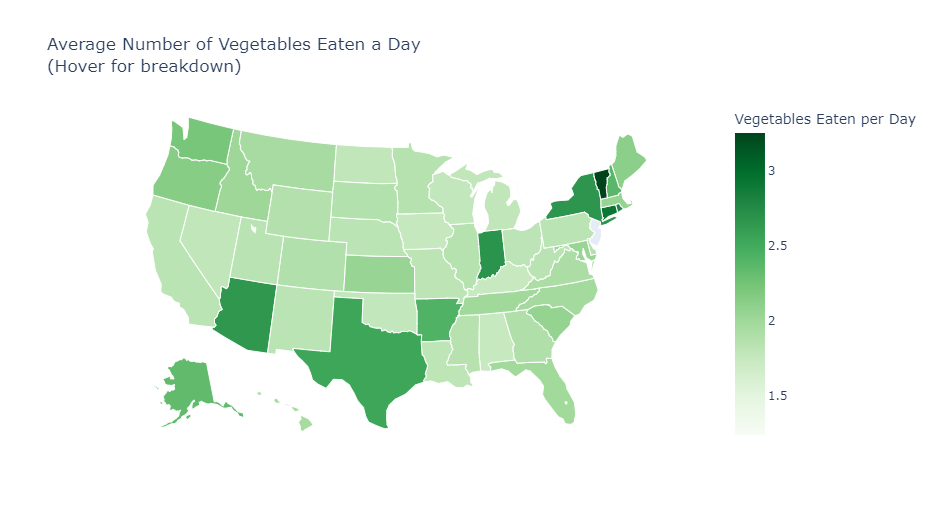
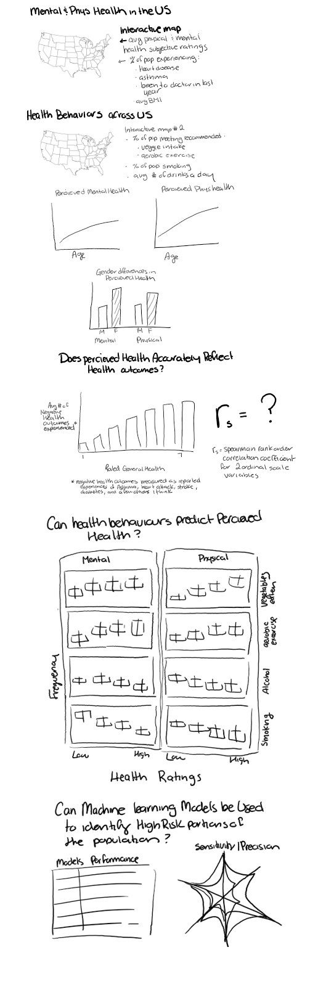

# Final Project Segment 1

### Initial Note to Grader

As I have been working on this by myself I had to create the database in full before I was able to move onto data cleaning and exploration. As such I am not entirely done my data exploration as of yet. You will see in analysis/data_exploration.ipynb that I have recoded the features, cleaned the data and completed a few of the choropleth maps however I have not yet completed them or created the additional visualizations of health and health behaviours over age or across gender. I will require a few more days to complete this and I appreciate your patience very much. Thank you!

## Selected Topic: Behavioural and Environmental predictors of  physical and mental health 

The topic that I will be investigated in this project is the predictive power of various environmental and behavioural factors in an individual's life on their mental and physical health. 

Environmental factors will include those such as geographical location (e.g., US state, urban vs rural location) or socio-economic status. Behavioural factors consist of both positive health behaviours (those considered to improve health outcomes) such as the frequency, duration and type of physical activity and negative health behaviours (those associated with poor health) such as smoking or drinking alcohol. 

Measures of physical and mental health will include subjective measures (how a respondent rates their psychological and physical health on a Likert scale) and objective measures such as the existence or severity of illnesses (e.g., heart disease, asthma). 

In this project, I will use feature analysis to evaluate which predictors are likely to account for the greatest variation in health outcomes. After these factors have been narrowed down, I will apply various machine learning models and assess their performance. I will mainly be testing the performance of linear regression models (single and multiple) and polynomial regression models because the interpretability of the model is crucial for understanding each predictor's role.

## Why I Selected This Topic

I have chosen to investigate health outcomes because the current health landscape is incredibly complex. The more clarity we can provide on improving outcomes, the better we can empower the public to take positive steps for their quality of life. Modern society has evolved at a pace that far exceeds our physiology, and it's challenging to discern how to best take care of ourselves with so many novel factors at play. 

It's simply too difficult to guess the best health practices for our bodies in an ever-changing landscape. I think the answer to this is simply looking at what people are doing already and relying on the data to tell us what works the best for the average person. Luckily we have access to a wealth of data on human behaviour and health outcomes, so I will try to use this to develop a machine learning model that can show which factors in our lives can have the greatest impact on our health so we can act accordingly. 

## Data Source
The data source I am using for this project is the 
[Behavioural Risk Factor Surveillance System (BRFSS) 2019 Survey](https://www.cdc.gov/brfss/annual_data/annual_2019.html)
 from the Center for Disease Control and Prevention  (CDC). This survey has been carried out over the phone in 49 states across the US every year since 2015. As of now, the 2019 survey data is the most recent data set available to the public. 
 
 This dataset consists of the answers to just under 400; however, a large number of these are follow-up questions about health conditions asked to a small number of respondents depending on their answers to previous questions, and they have been removed in the provisional database. Additionally, a number of questions were only asked in certain states. These have also been removed. 
 
Lastly, any records or columns that were missing any values were removed from the provisional database and the number of records shrunk from 418,268 to 11,041. My next steps will be to go through each item and assess how to handle NaNs and recode the data, as some are currently ordered in unstructured ways that do not provide any valuable insight. 

 
 The CDC provided an ASCII text file with the [following information on variable layout](https://www.cdc.gov/brfss/annual_data/2019/llcp_varlayout_19_onecolumn.html). This was used to parse the file and store the data in a .csv file which was cleaned in excel and data_cleaning.ipynb then stored as data/final_provisional_db.csv. These results can be interpreted using the provided [codebook](https://www.cdc.gov/brfss/annual_data/2019/pdf/codebook19_llcp-v2-508.HTML). I am working on parsing this file using beautifulsoup to store the coding schemes in a table in the SQL database I will be creating using the following structure. 
 
 
 
 *Note: the User_Answers shema has changed as reflected in schema.sql with columns for each question.
 
## Questions I Hope To Answer

 - What is the relationship between type, frequency and duration of activity and perceived general health, mental health and physical health?
- What impact do negative health behaviours such as smoking or drinking alcohol have on subjective health and negative health outcomes such as cancer, obesity and heart disease. 
- Does the prevalence of positive health factors outweigh the presence of negative health factors, or does one have a greater influence on our health? 
- If someone only has the energy or ability to make one change in their life to improve their health, what would be the best thing for them to focus on? 

## Exploratory Analysis Description

Exploratory analysis will aim to provide the audience with a look at health behaviours and outcomes in the U.S. in 2019. 
U.S.-wide statistics such as the average number of vegetable consumed a day or average minutes of physical activity will be shown for the country as a whole as well as in interactive choropleth maps of displaying the aggregates for each state (an example of which is displayed below). 
These factors will also be explored with regards to their relationships with age and gender.

## Analysis Description

First, the relationship between perceived general, physical and mental health and more objective measures of health such as the presence of disease will be explored to determine if people are actually able to accurately perceive and relay their current health status. This will be measured using Spearman Rank Order Correlation Analysis.
Next,  ordinal logistic regression will be performed to assess the ability of health behaviours to predict quality of life as measured by mental and physical health. 
Lastly, several complex machine learning algorithms including a random forest model and k-means clustering will be performed on the entire data set to see if it is possible to accurately identify high risk subgroups of the population for various health outcomes such as heart disease or diabetes. 

## Machine Learning Model

Preliminary data preprocessing: The data has been originally coded in ways that make each feature unusable, as such each feature is being recoded to reflect ordinal or continuous scales blank or unanswered questions being changed from number codes to Nan to allow them to be dropped. Continuous variables coded as 0-9999 (2 decimals implied) have been re-coded as 0.00 -99.99). 

Preliminary feature engineering and preliminary feature selection, including their decision-making process: Measures of the frequency for which negative and positive health behaviours have been chosen as features to predict mental and physical health. This was done to gain insight on what changeable behaviours can be modified to improve health. Feature analysis will then be performed to identify of these features which may predict the most variance in mental and physical health.

Model choice: Ordinal logistic regression will be used to determine how much of one's mental and physical health can be predicted by their positive health behaviours (physical activity, eating nutritious foods) and their negative health behaviours (eating fried foods, consuming alcohol frequently, smoking cigarettes). A key limitations of this model is that it lacks the precision of more complex models given the scale of the data and its simplicity however this is far outweighed by the benefit of interpretability. The entire purpose of this analysis is to determine which behaviours an individual can focus their energy on changing to improve their health, as such it is crucial that we be able to gain insight on the impact of each feature in this analysis. 
In addition, a variety of more complex classification models such as balanced random forests will be trained on the data to see if a model can help the CDC identify high risk subgroups of the population for negative health outcomes such as heart disease given the information they gather in the BRFSS each year.

## Storyboard

Plotly and go.choropleth will be used to make the choropleth maps, bar charts, scatter plots and area charts that visualize the results of data exploration. They will also be used to create the tables and spider chart used to describe the performance of various machine learning models and the box plots depicting the results from ordinal logistic regression.
The interactive element will be the choropleth maps which you can peruse with a drop down menu and hover over each state to see the aggregated data for the given feature. 

## [Google Slides link](https://docs.google.com/presentation/d/1sHpLSdKEW_r2qpCQj9jo3LttRBC7Vvh8iRqU_es1FQk/edit?usp=sharing)
