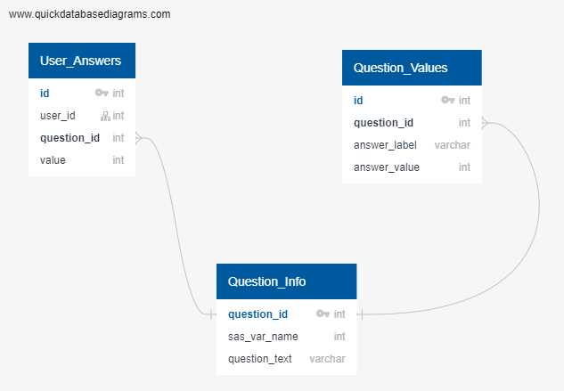

# Final Project Segment 1

### Initial Note to Grader

I connected with the course coordinator, Kyla,  to explain that my work schedule conflicts with this course's lecture schedule and requested an exemption from the mandatory attendance on the basis that I watch the recorded lectures the next day. I was permitted to stay in the course despite missing live lectures as long as I agreed to complete the final group project alone. As such, this project will be conducted solely by myself, and there will be no individual branches for other members on github or a communication protocol presented in this segment. 

## Selected Topic: Behavioural and Environmental Predictors of Physical and Mental Health 

The topic that I will be investigated in this project is the predictive power of various environmental and behavioural factors in an individual's life on their mental and physical health. 

Environmental factors will include those such as geographical location (e.g., US state, urban vs rural location) or socio-economic status. Behavioural factors consist of both positive health behaviours (those considered to improve health outcomes) such as the frequency, duration and type of physical activity and negative health behaviours (those associated with poor health) such as smoking or drinking alcohol. 

Measures of physical and mental health will include subjective measures (how a respondent rates their psychological and physical health on a Likert scale) and objective measures such as the existence or severity of illnesses (e.g., heart disease, asthma). 

In this project, I will use feature analysis to evaluate which predictors are likely to account for the greatest variation in health outcomes. After these factors have been narrowed down, I will apply various machine learning models and assess their performance. I will mainly be testing the performance of linear regression models (single and multiple) and polynomial regression models because the interpretability of the model is crucial for understanding each predictor's role.

## Why I Selected This Topic

I have chosen to investigate health outcomes because the current health landscape is incredibly complex. The more clarity we can provide on improving outcomes, the better we can empower the public to take positive steps for their quality of life. Modern society has evolved at a pace that far exceeds our physiology, and it's challenging to discern how to best take care of ourselves with so many novel factors at play. 

It's simply too difficult to guess the best health practices for our bodies in an ever-changing landscape. I think the answer to this is simply looking at what people are doing already and relying on the data to tell us what works the best for the average person. Luckily we have access to a wealth of data on human behaviour and health outcomes, so I will try to use this to develop a machine learning model that can show which factors in our lives can have the greatest impact on our health so we can act accordingly. 

## Data Source
The data source I am using for this project is the 
[Behavioural Risk Factor Surveillance System (BRFSS) 2019 Survey](https://www.cdc.gov/brfss/annual_data/annual_2019.html)
 from the Center for Disease Control and Prevention  (CDC). This survey has been carried out over the phone in 49 states across the US every year since 2015. As of now, the 2019 survey data is the most recent data set available to the public. 
 
 This dataset consists of the answers to just under 400; however, a large number of these are follow-up questions about health conditions asked to a small number of respondents depending on their answers to previous questions, and they have been removed in the provisional database. Additionally, a number of questions were only asked in certain states. These have also been removed. 
 
Lastly, any records or columns that were missing any values were removed from the provisional database and the number of records shrunk from 418,268 to 11,041. My next steps will be to go through each item and assess how to handle NaNs and recode the data, as some are currently ordered in unstructured ways that do not provide any valuable insight. 

 
 The CDC provided an ASCII text file with the [following information on variable layout](https://www.cdc.gov/brfss/annual_data/2019/llcp_varlayout_19_onecolumn.html). This was used to parse the file and store the data in a .csv file which was cleaned in excel and data_cleaning.ipynb then stored as data/final_provisional_db.csv. These results can be interpreted using the provided [codebook](https://www.cdc.gov/brfss/annual_data/2019/pdf/codebook19_llcp-v2-508.HTML). I am working on parsing this file using beautifulsoup to store the coding schemes in a table in the SQL database I will be creating using the following structure. 
 
 
 
## Questions I Hope To Answer

 - What is the relationship between type, frequency and duration of activity and perceived general health, mental health and physical health?
- What impact do negative health behaviours such as smoking or drinking alcohol have on subjective health and negative health outcomes such as cancer, obesity and heart disease. 
- Does the prevalence of positive health factors outweigh the presence of negative health factors, or does one have a greater influence on our health? 
- If someone only has the energy or ability to make one change in their life to improve their health, what would be the best thing for them to focus on? 
