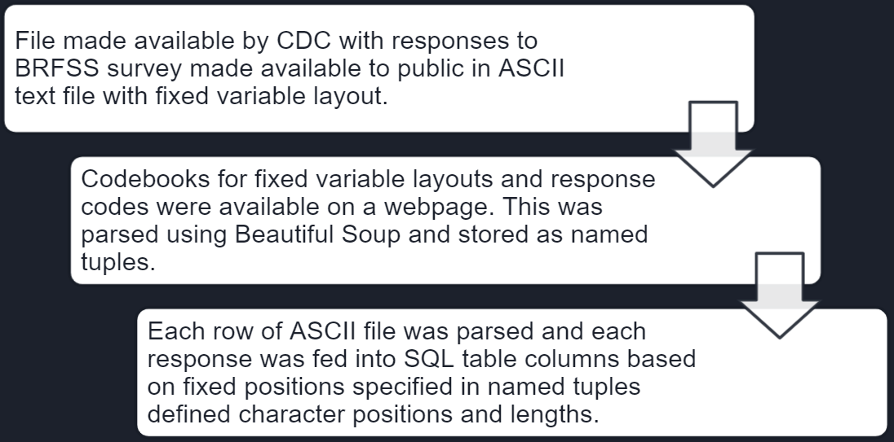
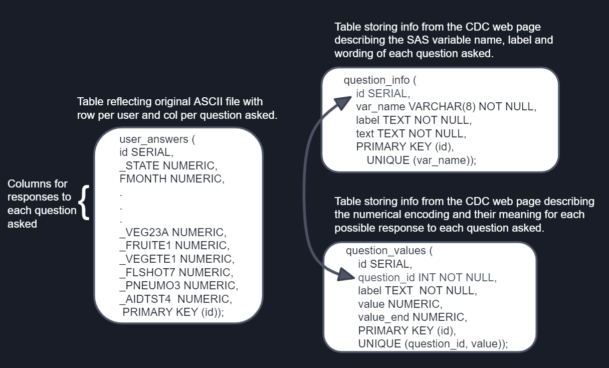
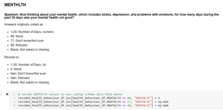
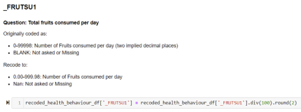
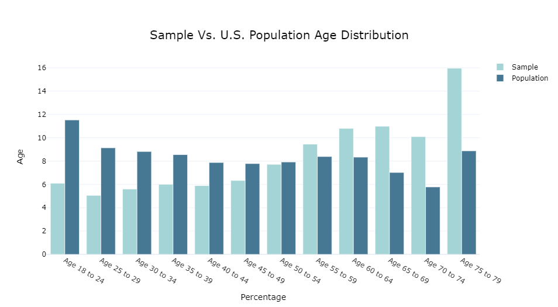
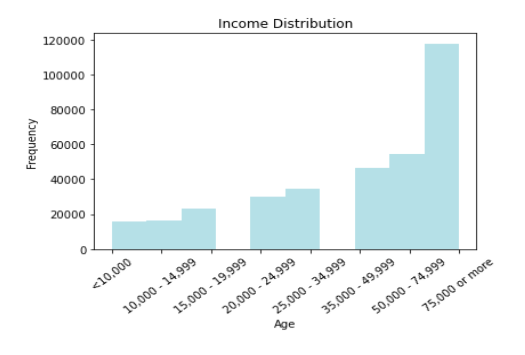
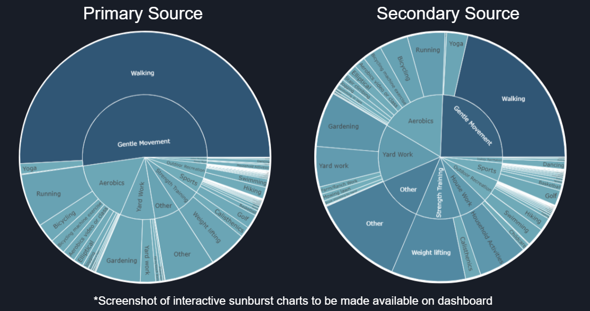

# Final Project: Behavioural Risk Factors in Mental and Physical Health
## High Impact Predictors and High Risk Groups for Negative Outcomes in the U.S.

### Initial Note
Due to my work schedule overlapping with live lectures I have been permitted to watch recordings in return for agreeing to carry out this final project alone. As such there will not be github branching or defined communication protocol and each segment will be completed by me alone.

## Selected Topic: Behavioural and Environmental predictors of  physical and mental health 

Environmental/Demographic factors: 
- Geographical location (e.g., US state, urban vs rural location) 
- Socio-economic status. 
- Education
- Race
- Age

Behavioural factors:
- Positive health behaviours (those associated with positive health outcomes)
	- Frequency, duration or type of physical activity
	- Consumption of fruits or vegetables
- Negative health behaviours (those associated with poor health):
	- Smoking
	- Drinking alcohol.

Measures of health:
- Subjective measures
	- How a respondent rates their general health on a Likert scale
	- Reports of bad mental or physical health days per month
- Objective measures
	- The existence or severity of illnesses (e.g., heart disease, asthma).

Primary Objectives:
- Provide a look at health and health behaviours in the U.S.  
- Determine which predictors have the greatest impact on health outcomes in the United States

## Why I Selected This Topic

Mental and physical health outcomes are currently dire in North America.
- 42.4% obesity prevalence in the US as of 2018 ([CDC, 2021](https://www.cdc.gov/obesity/data/adult.html#:~:text=The%20US%20obesity%20prevalence%20was,from%204.7%25%20to%209.2%25.))
- The Major Depressive Disorder affects > 6.7% of U.S. adults in a given year ([ADAA, 2021](https://adaa.org/understanding-anxiety/facts-statistics))
	- Leading cause of disability in the U.S. for ages 15 to 44.3 ([ADAA, 2021](https://adaa.org/understanding-anxiety/facts-statistics)).
- Approximately 39.5% of men and women in the U.S. will be diagnosed with cancer at some point during their lifetimes (based on 2015–2017 data; [National Cancer Inst., 2020](https://www.cancer.gov/about-cancer/understanding/statistics))

The current health landscape is incredibly complex. There is an abundance of information on health online with advice for optimizing health, losing weight, or curing diseases with varying degrees of reliability. It's challenging to discern how to best take care of ourselves with so many novel factors at play. 

The more clarity we can provide on improving outcomes, the better we can empower the public to take positive steps for their quality of life. 

## Data Source: BRFSS

Behavioural Risk Factor Surveillance System (BRFSS):
- A system of ongoing health-related telephone surveys designed to collect data on health-related risk behaviors and chronic health conditions
- A collaborative project between all of the states in the United States (US) and participating US territories and the Centers for Disease Control and Prevention (CDC).
- Analysis performed on data from the 2019 Annual Survey:
	- Data collected from  49 states, the District of Columbia, Guam, and Puerto Rico 
		- Exclusion: New Jersey (unable to collect enough BRFSS data in 2019 to meet the minimum requirements for inclusion)
	- Data collected from 418,268 noninstitutionalized adults (18 years or older) U.S. citizens
- Source: [Behavioural Risk Factor Surveillance System (BRFSS) 2019 Survey](https://www.cdc.gov/brfss/annual_data/annual_2019.html)

 
## Primary Research Questions

1.  What does mental and physical health look like in the United States today?
    
2.  What impact do environmental/demographic factors have on subjective health and negative health outcomes?
    
3.  What impact do health behaviours have on subjective health and negative health outcomes?
    
4.  If someone only has the energy or ability to make one change in their life to improve their health, what would be the best thing for them to focus on?
    
## Exploratory Analysis
### From ASCII and HTML to SQL
 

### SQL Database Structure
 
 
 ### Data Cleaning
 In original file, all instances where respondents refused to answer or responded that they did not know the answer were allocated numerical values. These needed to be replaced with a non-numerical value so as to not influence analysis. E.g.:
 
  

 Certain numerical factors were coded as integers with “implied decimal places”. These were converted to floats and recoded to reflect the implied numbers. E.g.:
  
 
 ### Tools for Analysis and Visualization
 - All data was stored in pandas data frames and analysis was performed in python. Numpy was used to mathematically clean data and calculate aggregates or summary statistics. 
- Visualizations were created using either Matplotlib (for quick sample summaries), Plotly graph_objects or plotly express.
- Interactive visualizations were brought online to be shared using plotly chart_studio.

 ### Sample Breakdown

BRFSS Sample (n = 418,268, Mage = 55.38, SDage = 17.62),  much older than U.S. Population. Perhaps this reflects greater access to older respondents or an increased likelihood to participate in optional studies with age.

54.6% Female, comparable to U.S. population (50.8%).

*U.S. population data gathered from [U.S. Census Bureau, 2014-2019](https://www.census.gov/data/tables/time-series/demo/popest/2010s-national-detail.html)
 
   
 
 Income appears in line with U.S. Population (median household income in 2019 =  $68,703; [U.S. Census Bureau, 2020](https://www.census.gov/library/publications/2020/demo/p60-270.html)) but lacking data on income >75k)
 
  
  
 Sample over-represents white portion of U.S. population (60.1%) and under-represents Hispanic (18.5%),  black (13.4%) and Asian (5.9%) portions of U.S. population. Native American (American Indian or Alaskan Native) population was accurately reflected at 1.3% ([U.S. Census Bureau, 2020](https://www.census.gov/quickfacts/fact/table/US/RHI325219)).
 
  
  
  Over half of the sample relied on walking as their primary source of physical activity. Secondary sources of physical activity were far more diverse which were more equally spread across gentle exercise, aerobics, yard work and strength training.
  
  

link to google slides: https://drive.google.com/file/d/1N9lrPJG-2MLiPuWUDKb_BakIKnftF0S9/view?usp=sharing

