# Final Project: Behavioural Risk Factors in Mental and Physical Health
## High Impact Predictors and High Risk Groups for Negative Outcomes in the U.S.

### Initial Note
Due to my work schedule overlapping with live lectures I have been permitted to watch recordings in return for agreeing to carry out this final project alone. As such there will not be github branching or defined communication protocol and each segment will be completed by me alone.

## Selected Topic: Behavioural and Environmental predictors of  physical and mental health 

Environmental/Demographic factors: 
- Geographical location (e.g., US state, urban vs rural location) 
- Socio-economic status. 
- Education
- Race
- Age

Behavioural factors:
- Positive health behaviours (those associated with positive health outcomes)
	- Frequency, duration or type of physical activity
	- Consumption of fruits or vegetables
- Negative health behaviours (those associated with poor health):
	- Smoking
	- Drinking alcohol.

Measures of health:
- Subjective measures
	- How a respondent rates their general health on a Likert scale
	- Reports of bad mental or physical health days per month
- Objective measures
	- The existence or severity of illnesses (e.g., heart disease, asthma).

Primary Objectives:
- Provide a look at health and health behaviours in the U.S.  
- Determine which predictors have the greatest impact on health outcomes in the United States

## Why I Selected This Topic

Mental and physical health outcomes are currently dire in North America.
- 42.4% obesity prevalence in the US as of 2018 ([CDC, 2021](https://www.cdc.gov/obesity/data/adult.html#:~:text=The%20US%20obesity%20prevalence%20was,from%204.7%25%20to%209.2%25.))
- The Major Depressive Disorder affects > 6.7% of U.S. adults in a given year ([ADAA, 2021](https://adaa.org/understanding-anxiety/facts-statistics))
	- Leading cause of disability in the U.S. for ages 15 to 44.3 ([ADAA, 2021](https://adaa.org/understanding-anxiety/facts-statistics)).
- Approximately 39.5% of men and women in the U.S. will be diagnosed with cancer at some point during their lifetimes (based on 2015–2017 data; [National Cancer Inst., 2020](https://www.cancer.gov/about-cancer/understanding/statistics))

The current health landscape is incredibly complex. There is an abundance of information on health online with advice for optimizing health, losing weight, or curing diseases with varying degrees of reliability. It's challenging to discern how to best take care of ourselves with so many novel factors at play. 

The more clarity we can provide on improving outcomes, the better we can empower the public to take positive steps for their quality of life. 

## Data Source: BRFSS

Behavioural Risk Factor Surveillance System (BRFSS):
- A system of ongoing health-related telephone surveys designed to collect data on health-related risk behaviors and chronic health conditions
- A collaborative project between all of the states in the United States (US) and participating US territories and the Centers for Disease Control and Prevention (CDC).
- Analysis performed on data from the 2019 Annual Survey:
	- Data collected from  49 states, the District of Columbia, Guam, and Puerto Rico 
		- Exclusion: New Jersey (unable to collect enough BRFSS data in 2019 to meet the minimum requirements for inclusion)
	- Data collected from 418,268 noninstitutionalized adults (18 years or older) U.S. citizens
- Source: [Behavioural Risk Factor Surveillance System (BRFSS) 2019 Survey](https://www.cdc.gov/brfss/annual_data/annual_2019.html)

 
## Primary Research Questions

1.  What does mental and physical health look like in the United States today?
    
2.  What impact do environmental/demographic factors have on subjective health and negative health outcomes?
    
3.  What impact do health behaviours have on subjective health and negative health outcomes?
    
4.  If someone only has the energy or ability to make one change in their life to improve their health, what would be the best thing for them to focus on?
    
## Exploratory Analysis
### From ASCII and HTML to SQL
 

### SQL Database Structure
 
 
 ### Data Cleaning
 In original file, all instances where respondents refused to answer or responded that they did not know the answer were allocated numerical values. These needed to be replaced with a non-numerical value so as to not influence analysis. E.g.:
 
  

 Certain numerical factors were coded as integers with “implied decimal places”. These were converted to floats and recoded to reflect the implied numbers. E.g.:
 
  
 
 ### Tools for Analysis and Visualization
 - All data was stored in pandas data frames and analysis was performed in python. Numpy was used to mathematically clean data and calculate aggregates or summary statistics. 
- Visualizations were created using either Matplotlib (for quick sample summaries), Plotly graph_objects or plotly express.
- Interactive visualizations were brought online to be shared using plotly chart_studio.

 ### Sample Breakdown

BRFSS Sample (n = 418,268, Mage = 55.38, SDage = 17.62),  much older than U.S. Population. Perhaps this reflects greater access to older respondents or an increased likelihood to participate in optional studies with age.

54.6% Female, comparable to U.S. population (50.8%).

*U.S. population data gathered from [U.S. Census Bureau, 2014-2019](https://www.census.gov/data/tables/time-series/demo/popest/2010s-national-detail.html)
 
   
 
 Income appears in line with U.S. Population (median household income in 2019 =  $68,703; [U.S. Census Bureau, 2020](https://www.census.gov/library/publications/2020/demo/p60-270.html)) but lacking data on income >75k)
 
  
  
 Sample over-represents white portion of U.S. population (60.1%) and under-represents Hispanic (18.5%),  black (13.4%) and Asian (5.9%) portions of U.S. population. Native American (American Indian or Alaskan Native) population was accurately reflected at 1.3% ([U.S. Census Bureau, 2020](https://www.census.gov/quickfacts/fact/table/US/RHI325219)).
 
  
  
  ### Interactive elements with Plotly  Go Objects and Chart Studio
  
  #### Sources of physical exercise
  
  Over half of the sample relied on walking as their primary source of physical activity. Secondary sources of physical activity were far more diverse which were more equally spread across gentle exercise, aerobics, yard work and strength training.
  
 

 [Link to live, interactive primary source of exercise sunburst chart](https://plotly.com/~elizkimcyr/8/)
 
  [Link to live, interactive secondary source of exercise sunburst chart](https://plotly.com/~elizkimcyr/8/)

#### Health Behaviours and Outcomes Across the U.S.

State differences in health behaviours juxtiposed with health outcomes hint at relationship between geographic patterns in nutrition, exercise and health outcomes such as reported health and the prevalence of negative outcomes. 

  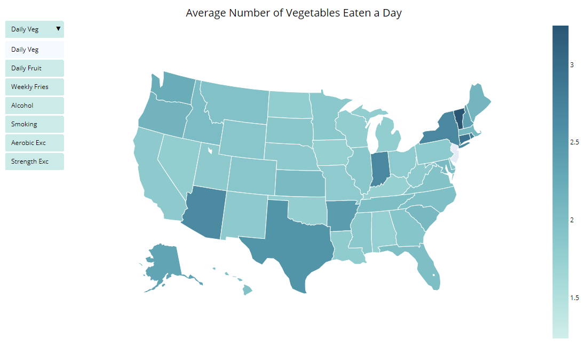

[Link to live, interactive choropleth](https://plotly.com/~elizkimcyr/3/)

  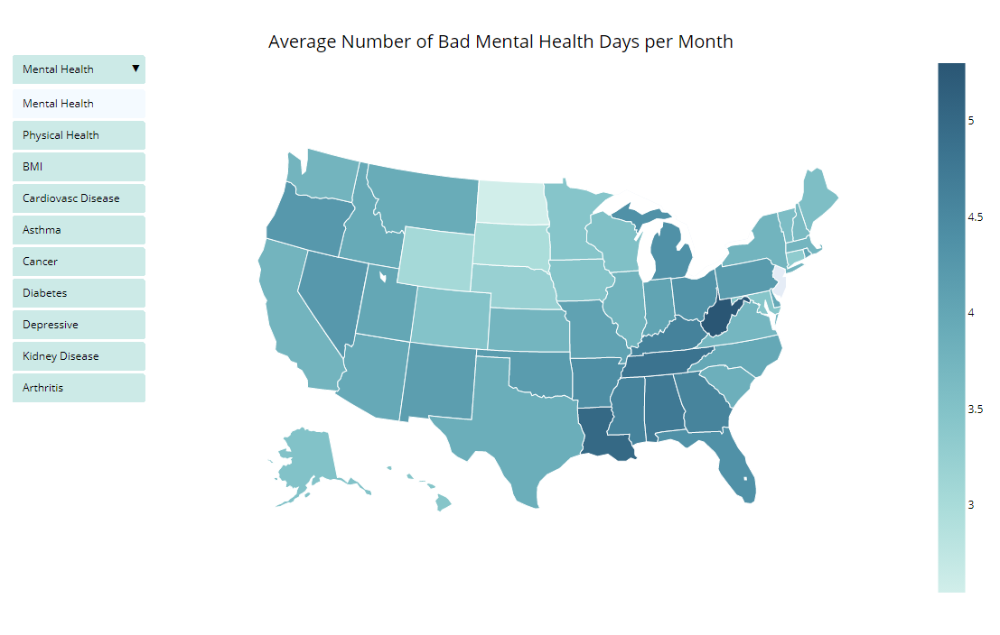

[Link to live, interactive choropleth](https://plotly.com/~elizkimcyr/5/)

### Exploration of Potential Predictors of Health
#### Health Across Age 

As expected, physical health declines with age. Surprisingly, however, mental health improves with age in a completely inverse relationship to have of physical health and age.

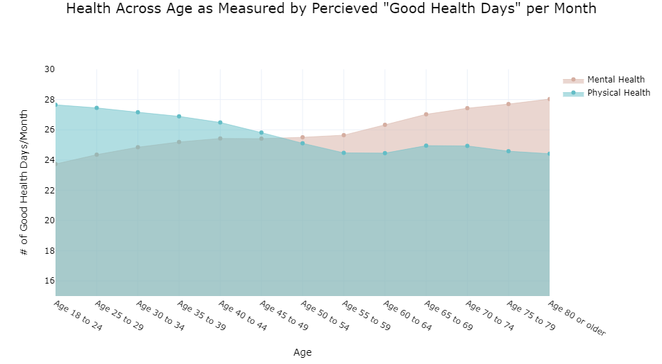
  
Health ratings are lower in the Asian and White subgroups. This may reflect differences in health. It may also reflect standards for rating or perceiving one’s health.
  
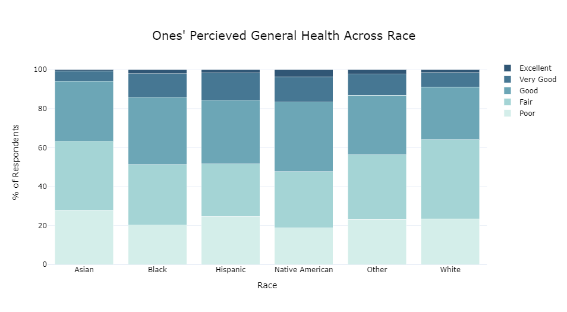

#### Education x Health

Both mental health and physical health (as measured by reported days of "good"  mental or physical health per month)  increase with the highest level of achieved education. 

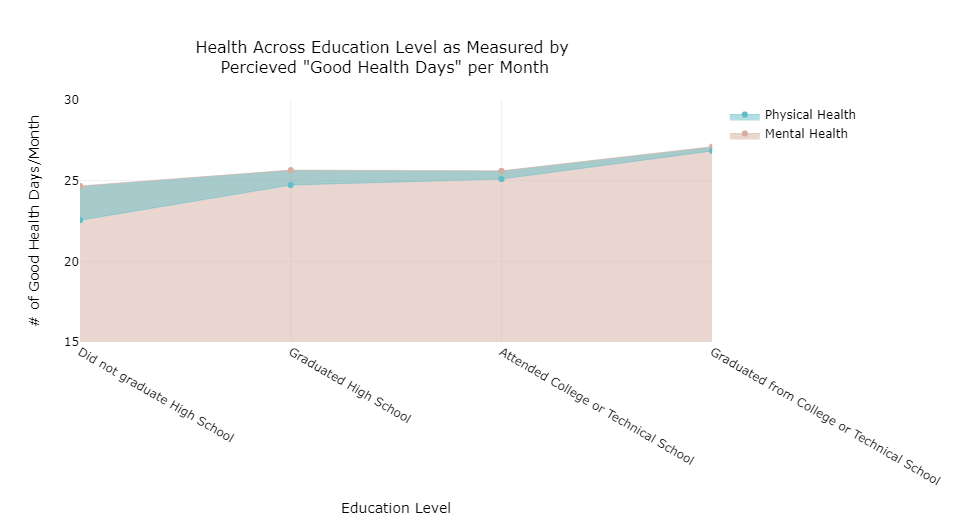

#### Income x Health

Similarly to education, household income shows strong postive relationships to both mental and physical health. 

#### Income x Education x Health

The following heatmaps display average mental and physical health (as measured by reported days of "good"  mental or physical health per month) for individuals at each level of educational attainment and household income bracket. The positive relationships between both income and education with reported health appear to compound with income having a greater effect. This leads to a sharp increase in both positive mental and physical health days  for those with greater financial and educational resources. A notable deviation to these trends is a decreased health for those who have attended some post-secondary school. This may reflect the health strain and lack of resources available to students currently enrolled  in college or technical school.

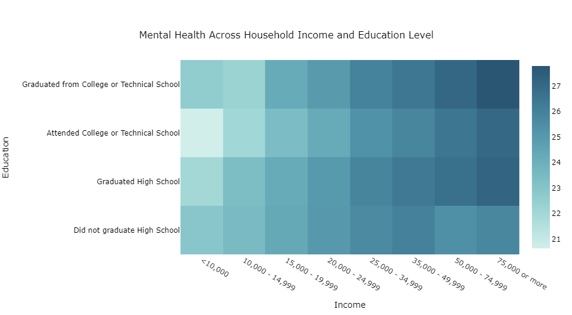

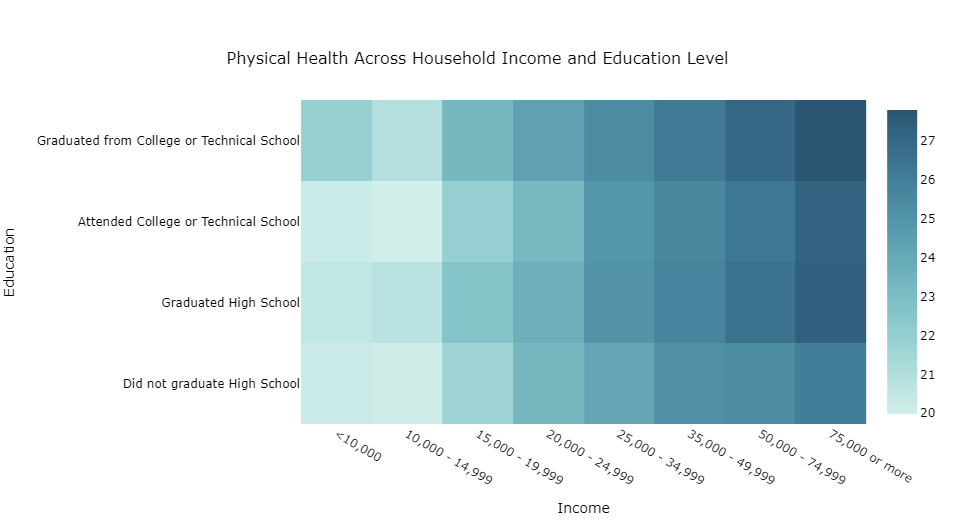

## Analysis Process

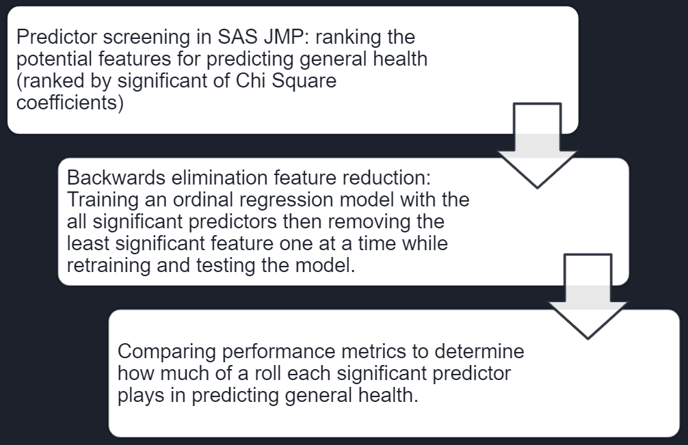

### Predictor Screening

Collinearity between nutrition features rendered all but one useless.
Counterintuitively, primary exercise choice and frequency were weakly linked to general health if at all. Secondary exercise info was more promising.
Income and BMI  were, by far and large, the least independent features from the target and expected to have the greatest impact on model performance.

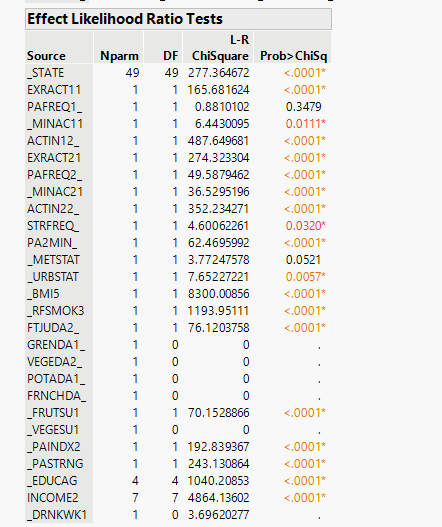

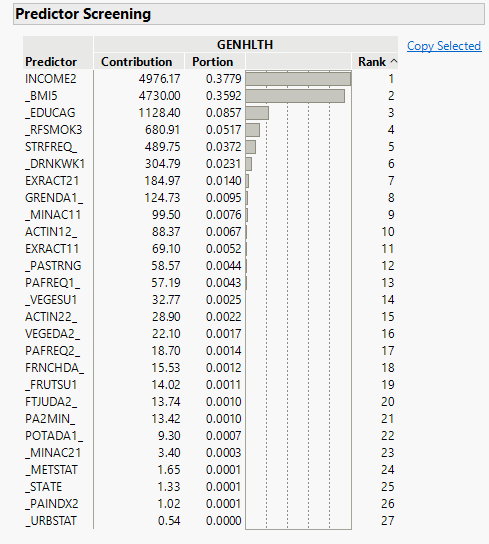

###  Data Preprocessing

-   Features were visualized to determine their distribution. For this that appeared more gaussian, scikit-learns StandardScaler() was used and for those which appeared far from normal had scikit-learns PowerScaler() applied to fit the data closer towards a normal distribution post-analysis.    
-   The target was fit into a range of -1 to 1
-   The data was then split into training and testing sets with a test size of 33%
    
 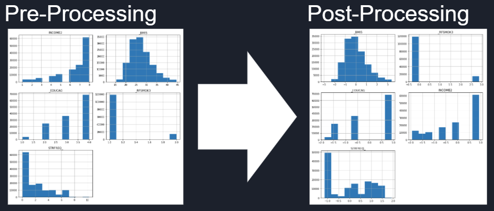

### Fitting the model

- Target: General health rated on a 5-point Likert scale (ordinal)
- Model: Ordinal Logistic Regression
	- Sci-kit learn does not have a module for performing ordinal logistic regression 
	- mord is a python package that implements some ordinal regression methods following the scikit-learn API.
		- mord.LogisticIT (immediate-threshold regression) and mord.LogisticAT (all-threshold) were tried and found to have similar results. LogisticIT was chosen so penalty would relate to distance of y-predictions to actual y values. 
- Scikit learns metric functions were used to produce confusion matrices, classification reports and values for accuracy and mean absolute error so performance could be compared between models.

### Ordinal Regression Results

The addition of features resulted in a small increase of prediction accuracy and reduction of MAE. Precision was highest when only income was used however this is only because no false predictions for classes 1, 4 or 5 were made as a result of those classes being predicted 0 times. as features increase the spread of predictions widens somewhat closer towards the actual spread of y however the predictions consistently cluster towards classes 2 and 3.

 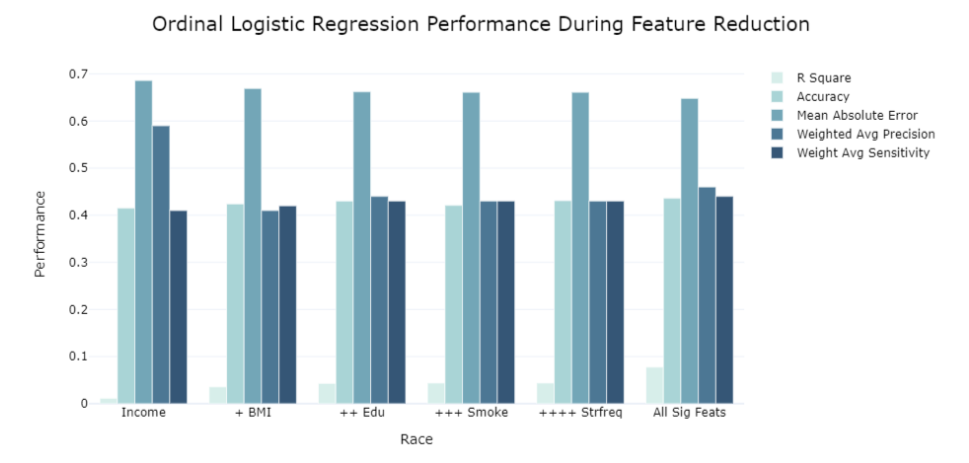
 
  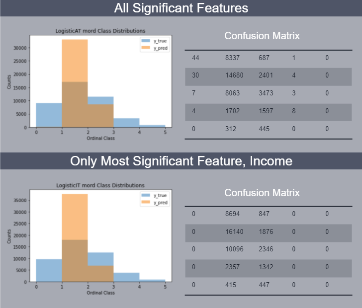

## Future Analysis

- Try to improve models able to predict edge cases (classes 1, 4 and 5)
	- Try oversampling to create simulated data points for edge case classifications to see if this improves the models ability to predict such cases.
- Investigate relationship between income and health more closely, look for mechanisms behind the relationship to find actionable steps one could take to improve health that are more accessible than increasing their income or paths for government organizations to increase access to these sources of improved health (e.g., does access to health-care or time for a second source of physical activity increase with income and account for some of the variable of general health?)
- Investigate BMI independently from general health. Use binary logistic regression to identify the factors at play with increased BMI (e.g., does increase physical activity or nutrition increase probability of being obese more? What are the relationships between income and nutrition and exercise?)
- Investigate impact of age on relationships to see if samples older demographic has an impact on findings that doesn’t relate to general U.S. population.

## What I Would Have Done Differently

- Tried out tableau for a more convenient dashboard tool
- Carried out less analysis on individual features until after predictor analysis so I could focus my energy on the features that played the greatest role in predicting general health (for example, I would have focused more on relationships between income and other features and focused more on the secondary source of exercise than the primary source, which I had anticipated being more important). 
- Used R instead of python as the documentation for MASS is much more informative than that for mord and it appears to have a more active user-base.

[link to google slides](https://drive.google.com/file/d/1N9lrPJG-2MLiPuWUDKb_BakIKnftF0S9/view?usp=sharing)

